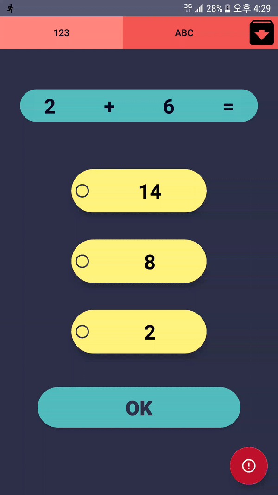
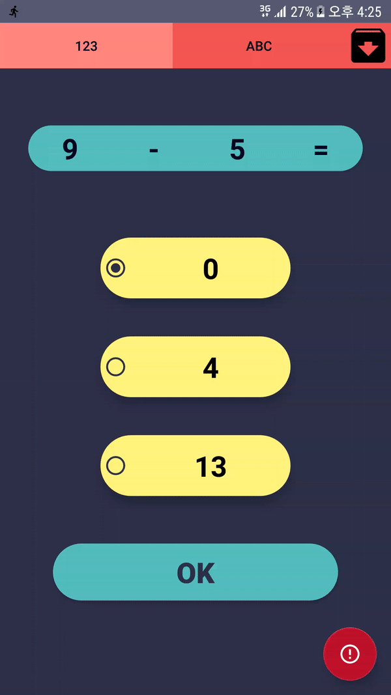
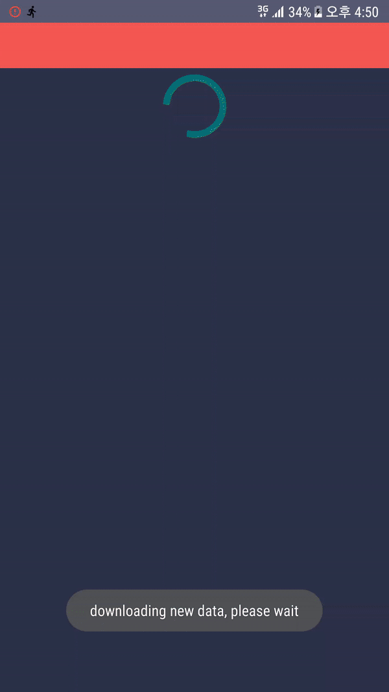
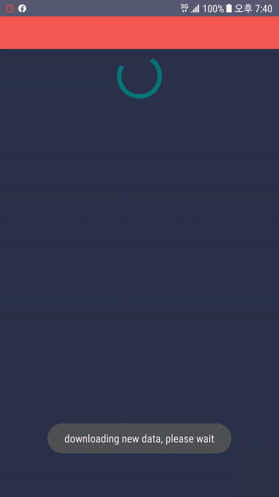

# [FunPlus - ParentPlus](https://github.com/geonhuiy/SensorMobileProject)

An Android mobile game for children under school age to learn numbers and words
and send photo and location (from FunPlus) to parent (ParentPlus) in case of emergency

Metropolia UAS third-year student project for Sensor Based Mobile Course


## How to setup and use
1. Clone the repository from and run with Android Studio
1. Run Funplus on one device, and ParentPlus on another
1. Allow permission with camera, location, Microphone and storage
1. Images for ARcore scanning are in assets folder  
NOTE: url to upload and download data is not provided  
The upload url should be specified under `FunPlus/app/java/com.example.funplus/utility/Uploader.kt`  
The download url should be specified under `ParentPlus/app/java/com.example.parentplus/utility/DownloadTask.kt & NewDataChecker.kt`

## Hardware and/or software requirements
1. SDK >= 26
1. ARCore Support
1. Camera
1. Audio/Microphone
1. Sensor (step counter)
1. Network connected

## Server side scripts

### lastModifideTime.php
```
<?php
echo filemtime("sosFile.txt");
echo "<br>";
echo "Content last changed: ".date("F d Y H:i:s.", filemtime("sosFile.txt"));
?>
```
### upload_textform.php

```
<?php
$target_dir = "uploads/";
$target_file = $target_dir . basename($_REQUEST["filename"]);
echo $_POST["filename"];
echo $_REQUEST["filename"];

$uploadOk = 1;
if ($uploadOk == 0) {
    echo "Sorry, your file was not uploaded.";
} else {
   echo file_put_contents($target_file, $_REQUEST["file-data"]);
}
?>
```

## AR image-number pairs
####  123


####  234


####  345


#  456


#  567


#  678


## How the app looks like











## Dependencies
``` 
    implementation fileTree(dir: 'libs', include: ['*.jar'])
    implementation "org.jetbrains.kotlin:kotlin-stdlib-jdk7:$kotlin_version"
    implementation 'androidx.appcompat:appcompat:1.1.0'
    implementation 'androidx.core:core-ktx:1.1.0'
    implementation 'androidx.constraintlayout:constraintlayout:1.1.3'
    implementation 'androidx.legacy:legacy-support-v4:1.0.0'
    testImplementation 'junit:junit:4.12'
    androidTestImplementation 'androidx.test:runner:1.2.0'
    androidTestImplementation 'androidx.test.espresso:espresso-core:3.2.0'

    implementation 'com.google.ar:core:1.12.0'
    implementation 'com.google.ar.sceneform.ux:sceneform-ux:1.12.0'
    implementation "org.jetbrains.anko:anko:$anko_version"

    implementation 'androidx.recyclerview:recyclerview:1.0.0'

    implementation 'org.osmdroid:osmdroid-android:6.1.0'

    def room_version = "2.2.0-rc01"
    apply plugin: "kotlin-kapt"
    implementation "androidx.room:room-runtime:$room_version"
    kapt "androidx.room:room-compiler:$room_version"

    def lifecycle_version = "2.1.0"
    implementation 'androidx.lifecycle:lifecycle-extensions:2.1.0'
    implementation 'androidx.lifecycle:lifecycle-runtime:2.1.0'
    implementation 'com.google.android.material:material:1.1.0-alpha10'
    implementation 'com.google.android.gms:play-services-location:17.0.0'
    implementation "org.jetbrains.anko:anko-commons:0.10.8"

    def retrofit_version = '2.6.1'
    implementation "com.squareup.retrofit2:retrofit:$retrofit_version"
    implementation "com.squareup.retrofit2:converter-gson:$retrofit_version"
    implementation 'com.jjoe64:graphview:4.2.2'

    implementation 'de.hdodenhof:circleimageview:3.0.0'
    implementation 'de.hdodenhof:circleimageview:3.0.0'
    ```


